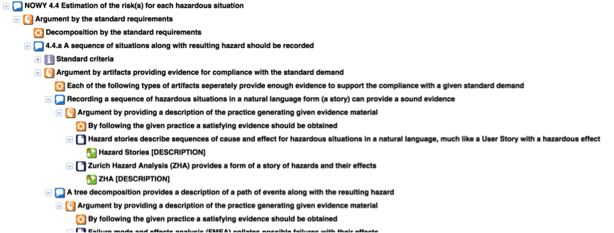
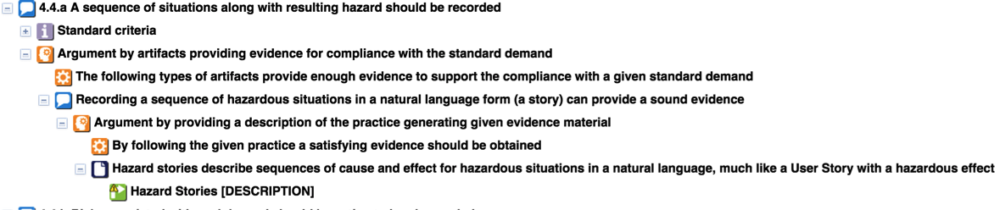
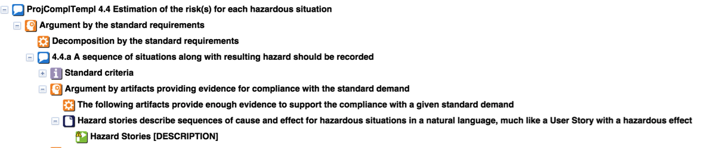

## Overview

In order to ensure the required safety level in a given project has been acquired or maintained, AgileSafe uses a set of assurance cases. The main idea behind this set is to provide assurance cases both for the software development process and for the end product itself. While the latter is the essence of demonstrating product conformance with a given standard or a guideline, the former is a mean to obtain it, a technique that will allow a company to ensure the practices they’re choosing are suitable for this particular project with its safety requirements imposed by standards. 

The idea of assurance arguments is used in AgileSafe method on two levels: one is for software development practices- the process and the other concerns the product. 
While the concept of using assurance arguments for demonstrating conformity to the standards has already been discussed, introducing an additional level of argument is a more innovative concept. Both Practices Compliance Template and Project Compliance Template are part of this level.
All of the arguments in the method are developed separately for each applicable standard in order to support separate certification processes and are based on the standard structure.

## Practices Compliance Template

Practices Compliance Template is a template based on the idea of assurance arguments. It is developed separately for each standard and it is based on the standard requirements, however all of the Practices Compliance Templates should have the same structure in terms of argumentation form. It is independent from Project characteristics and represents possible conformance of practices from AgileSafe Practices Knowledge Base with particular standard requirements. For each standard requirement at its most detailed level, as indicated in the content of the standard, an argumentation strategy should be presented - *Argument by artifacts providing evidence for compliance with the standard demand. It is followed by the justification that Each of the following types of artifacts provide enough evidence to support the compliance with a given standard demand.*  Subsequently a list of claims concerning different types of practices, which may contribute to satisfying the standard demand is presented. Each claim should be justified with *Argument by providing a description of the practice generating given evidence material because By following the given practice a satisfying evidence should be obtained.*
Below is given an example of a Practices Compliance Template for an excerpt of ISO 14971 standard– 4.4 Risk Analysis: Estimation of the risk(s) for each hazardous situation – 4.4a A sequence of situations along with resulting hazard should be recorded.

Provided that the Practices Knowledge Based should stay unchanged, the Practices Compliance Templates once prepared for the specific standard can stay unchanged as well for every project, which has to comply with this standard. Nevertheless, the Practices Knowledge Base is expected to be updated and new practices should be added during the lifetime of using the method. Thus it can be expected that Practices Compliance Templates will change and evolve during the course of the method usage.  New practices added to the Practices Knowledge Base should be added to the Practices Compliance Templates as well.

## Project Compliance Template

Project Compliance Template is a Practices Compliance Template adapted to the specific project, with Project Practices Set being the additional factor. In essence, it is a customized version of the Practices Compliance Template, presenting only the practices used in the project along with the evidence they are producing.

##	Project Compliance Argument

Project Compliance Argument is an assurance argument in its traditional form. It is structured around a particular standard and is used to collect the required evidence and in effect to demonstrate conformance with given standard. The evidence should be collected with accordance to the Project Compliance Template and be an effect of Practices application process.
 
 