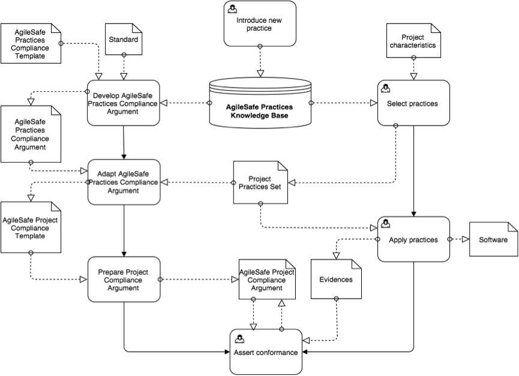

## BPMN Scheme

## Processes 

List of Processes:

*	Introduce New Practice
*	Develop AgileSafe Practices Compliance Argument
*	Adapt AgileSafe Practices Compliance Argument
*	Prepare Project Compliance Argument
*	Assert conformance
*	Select practices 
*	Apply practices

Actors:

*	Method
*	User – Process Manager?
*	Team


    
## Artifacts

List of Artifacts:

*	Standard
*	AgileSafe Practices Knowledge Base
*	AgileSafe Practices Compliance Pattern
*	AgileSafe Practices Compliance Argument
*	AgileSafe Project Compliance Template
*	AgileSafe Project Compliance Argument
*	Project characteristics
*	Project Practices Set
*	Software
*	Evidences

Types: External (not dependent on the method) / supplied by the method / created with a support of the method


