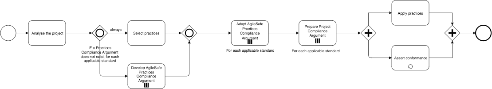

## BPMN Scheme

## Processes 

List of Processes:

* AS.P.1 Analyse the project
* AS.P.2 Select practices
* AS.P.2.1 Introduce new practice
* AS.P.3 Develop AgileSafe Practices Compliance Argument
* AS.P.4 Adapt AgileSafe Practices Compliance Argument
* AS.P.5 Prepare Project Compliance Argument
* AS.P.6 Assert conformance
* AS.P.7 Apply practices

Actors:

*	Method
*	User

    
## Artifacts

List of Artifacts:

* AS.A.1 Standard
* AS.A.2 AgileSafe Practices Knowledge Base
* AS.A.3 AgileSafe Practices Assurance Template
* AS.A.4 AgileSafe Practices Assurance Argument
* AS.A.5 AgileSafe Project Assurance Template
* AS.A.6 AgileSafe Project Assurance Argument
* AS.A.7 Project characteristics
* AS.A.8 Project Practices Set
* AS.A.9 Software
* AS.A.10 Evidences

Types: External (not dependent on the method) / supplied by the method / created with a support of the method
